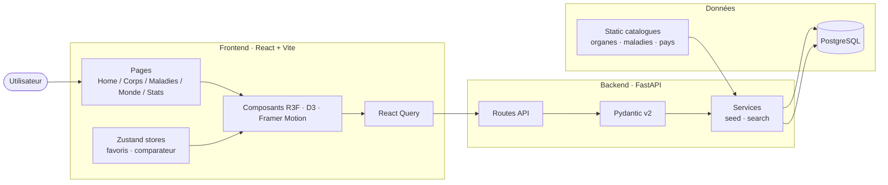
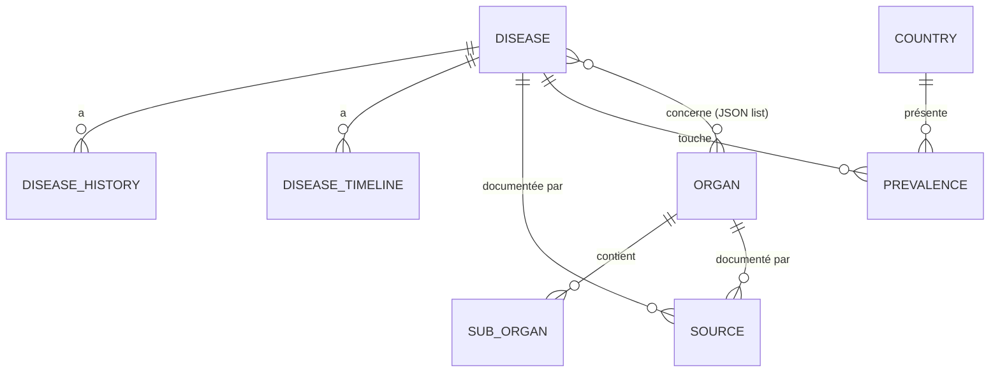
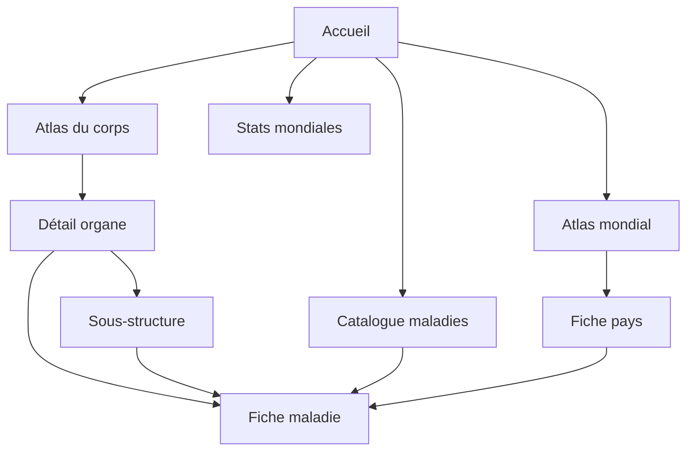

# Architecture

## Vue d'ensemble

## Modules backend

| Route prefix    | Description |
|-----------------|-------------|
| `/api/organs`   | Catalogue d'organes, sous-structures, maladies liées |
| `/api/diseases` | Catalogue des maladies, filtres et tri |
| `/api/countries`| Pays + indicateurs santé |
| `/api/world`    | Agrégats géographiques (burden global, par maladie) |
| `/api/stats`    | KPIs santé mondiale, timelines |
| `/api/glossary` | Lexique médical |
| `/api/quiz`     | Génération dynamique de questions |
| `/api/search`   | Recherche fuzzy multi-entités |

## Modèles principaux

## Navigation utilisateur

